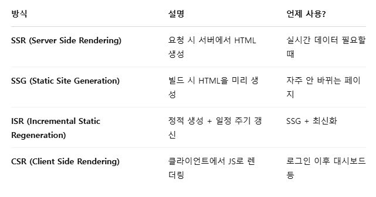

# React
> React is a JavaScript library for rendering user interfaces (UI)
* facebook에서 개발한 자바스크립트 라이브러리
## 특징
1. 컴포넌트 기반: 화면을 여러 개의 컴포넌트로 나누어서 개발 가능
2. 가상 dom: 화면이 변경 될 때 전체 html을 그리는 대신 변경된 부분만 업데이트
3. 선언형 프로그래밍: html을 직접 조작하지 않음, 원하는 ui상태를 선언하면 React가 알아서 업데이트(예: count값이 변경되면 React가 알아서 변경)
4. React hooks: 클래스 컴포넌트 없이도 상태(state) 생명주기(lifecycle)를 다룰 수 있도록 도와주는 기능(useState, useEffect 등)
5. React + SPA: 한 개의 html 페이지에서 여러 개의 화면을 동적으로 변경하는 SPA에 많이 활용됨

### 왜 프레임워크가 아닌가
1. 필수적인 기능이 부족함
    * 프레임워크는 일반적으로 라우팅, 상태 관리, API 호출, 빌드 시스템 같은 기능을 자체적으로 제공
    * React는 UI 렌더링에 집중된 라이브러리일 뿐, 라우팅(react-router), 상태 관리(Redux, Recoil, Zustand 등), API 호출(Axios, fetch) 같은 걸 직접 포함하고 있진 않다.
2. 자유도가 높음
    * React는 특정 방식으로 개발을 강요하지 않는다. 원하는 라이브러리와 조합해서 개발 스타일을 자유롭게 정할 수 있다.
    * 반면, 프레임워크(Vue, Angular 등)는 보통 자체적인 개발 방식이 정해져 있다.
3. 프레임워크는 전체적인 구조를 잡아주고, 라이브러리는 특정 기능을 제공
    * React는 UI 개발을 쉽게 해주는 라이브러리일 뿐, 전체적인 애플리케이션 구조를 관리하는건 개발자의 선택
    * Vue, Angular 같은 프레임워크는 앱의 구조까지 정해줘서 처음부터 끝까지 일관된 방식으로 개발

### 추천하는 방식
> If you want to build a new app or website with React, we recommend starting with a framework.

* React 공식 레퍼런스에서는 새로 시작하는 경우 프레임워크로 시작하는 것을 추천하고 있다 (Next.js 등)
* 레퍼런스에서 소개하는 풀스택 프레임워크는 CSR(클라이언트렌더링)), SPA(단일페이지앱), SSG(정적사이트렌더링)를 지원하므로 서버가 꼭 필요하지 않다.

## 컴포넌트
* UI를 구성하는 독립적인 조각
* 버튼, 입력 폼, 네비게이션 바 같은 것들을 각각 컴포넌트로 만들고, 이를 조합하여 화면을 구성함
### 특징
1. 재사용 가능: 여러 곳에서 컴포넌트를 재사용할 수 있음
2. 독립적: 각각의 컴포넌트는 자체적인 상태와 기능을 가짐
3. 계층 구조: 컴포넌트 안에 다른 컴포넌트를 포함할 수 있음
### 구현 방법
* 일전에는 클래스형 컴포넌트가 많이 쓰였지만 현재는 함수형 컴포넌트와 Hooks가 대체함
* 꼭 대문자로 시작해야함
```javascript
import { useState } from "react";

function Counter() {
  const [count, setCount] = useState(0);

  return (
    <div>
      <h1>Count: {count}</h1>
      <button onClick={() => setCount(count + 1)}>+1</button>
    </div>
  );
}

export default Counter;
```
* 작성한 컴포넌트를 다른 컴포넌트에 중첩 사용 할 수 있다.
```javascript
import Counter from "../components/counter";

export default function CountPage() {
  return (
    <div>
      <Counter></Counter>
      <Counter></Counter>
    </div>
  )
}
```

## JSX(Javascript Syntax eXtension)
* React에서 UI를 만들 때 사용하는 문법
### 특징
* HTML와 비슷하거나 같아보이지만 Javascript 코드 안에서 사용됨
* class 속성 대신 className을 사용해야 함
* 태그를 반드시 닫아야함
    * ``, `<br />`같은 태그도 반드시 닫아야 함
* Javascript 표현식을 `{}`안에서 사용 가능
```javascript
const name = "React";

function App() {
  return <h1>Hello, {name}!</h1>;
}

export default App;
```
### 실제 변환되는 모습
* JSX는 과거에는 내부적으로 `React.createElement()` 함수로 변환되었다.
    * https://legacy.reactjs.org/blog/2020/09/22/introducing-the-new-jsx-transform.html#whats-a-jsx-transform
```javascript
const element = React.createElement("h1", null, "Hello, ", name, "!");
```
* React 17부터는 다음과 같이 변환한다.
```javascript
// Inserted by a compiler (don't import it yourself!)
import {jsx as _jsx} from 'react/jsx-runtime';

function App() {
  return _jsx('h1', { children: 'Hello world' });
}
```
* JSX를 사용하면 코드가 훨씬 직관적이다.

### 규칙
1. 단일 루트 요소
    * `<div></div>` 또는 `<></>` 와 같은 단일 부모 태그로 요소를 래핑해야함
    ```javascript
    <div>
      <h1>Hedy Lamarr's Todos</h1>
      
      <ul>
        ...
      </ul>
    </div>
    ```
    * 빈 `<></>`를 `Fragment`라고 함
2. 모든 태그를 닫아야한다
3. 대부분의 것 (속성)을 camelCase로 표현해야 한다
    * 기존 javascript에는 변수 이름에 제한이 있다. 예를 들어 대시를 포함하거나`stroke-width`, 예약어를 쓴다거나`class`
    * 이러한 부분이 React에서 많은 HTML, SVG속성을 camelCase로 작성하는 이유다
    * `class`의 경우는 예약어 이므로 `className`를 사용한다.
    ```javascript
    
    ```
### 개꿀팁
* html을 그냥 가져다 jsx에 붙히면 안되는 경우가 많다.
* 제약조건이 html보다 많기 때문
* https://transform.tools/html-to-jsx 변환기를 쓰면 보다 간편하게 사용 가능

## JSX 활용
### 따옴표로 문자열 전달
JSX에 문자열 속성은 작은따옴표나 큰따옴표로 묶는다.
```javascript
export default function Avatar() {
  return (
    
  );
}
```
* 해당 예제에서는 `"/sample.png"` 및 `"sample"`이 문자열로 전달된다.
* 동적으로 전달 시에는 `{}`로 묶으면 된다.
```javascript
export default function Avatar() {
  const src = '/sample.png'
  const desc = 'sample'
  return (
    
  );
}
```

### javascript 전달
```javascript
const today = new Date();

function formatDate(date: Date) {
  return new Intl.DateTimeFormat(
    'en-US',
    { weekday: 'long' }
  ).format(date);
}

export default function Page() {
  return (
    <h1>Today Is {formatDate(today)}</h1>
  );
}
```
* 중괄호 안에 javascript 표현식을 사용 가능하다

### css 및 기타 객체 전달
```javascript
export default function Page() {
  return (
    <ul style={{
      backgroundColor: 'black',
      color: 'pink'
    }}>
      <li>Improve the videophone</li>
      <li>Prepare aeronautics lectures</li>
      <li>Work on the alcohol-fuelled engine</li>
    </ul>
  );
}
```
* 중괄호를 2개 중첩하여 사용하여 객체 및 css 등을 전달할 수 있다
* css의 경우 인라인 스타일을 사용할 수 있지만 대부분의 경우 클래스로 적용한다
* css 인라인 스타일의 경우 camelCase로 작성해야하는 점 주의

## Props 전달하기
React 컴포넌트는 props를 사용하여 통신
### 자식 컴포넌트에 props 전달
```javascript
export default function Page() {
  return (
    <div>
      <p>Hello child component</p>
      <MyButton
        text={"hello props"}
        style={{ bgColor: "#d3d3d3", size: "50px" }}
      />
    </div>
  );
}
```
MyButton 컴포넌트에 text와 style을 전달, text는 string, style은 object
```javascript
export default function MyButton({
  text="hello default",
  style={ bgColor: "yellow", size: "50px"}
}: {
  text: string
  style: { bgColor: string, size: string }
}) {
  return (
    <button style={{ backgroundColor: style.bgColor, width: style.size }}>{text}</button>
  )
}
```
Mybutton은 위와 같이 props를 선언할때 구조 분해 할당을 할 수 있음
```javascript
export default function MyButton(props) {
  let text = props.text
  let style = props.style

  return (
    <button style={{ backgroundColor: style.bgColor, width: style.size }}>{text}</button>
  )
}
```
너무 많은 props의 경우 `spread` 구문을 통해 합리적으로 전달 가능
```javascript
function Profile(props) {
  return (
    <div className="card">
      <Avatar {...props} />
    </div>
  );
}
```

## 이벤트
### 이벤트 정의
```javascript
export default function Button() {
  function handleClick() {
    alert('clicked')
  }

  return (
    <button onClick={handleClick}>
      click me
    </button>
  )
}
```
* button에 handleClick을 prop으로 전달
* 일반적으로 handle로 시작하고 뒤에 이벤트 이름이 붙음 `handleClick` `handleMouseEnter`

```javascript
export default function Button1() {
  return (
    <button onClick={() => {
      alert('clicked')
    }}>
      click me2
    </button>
  )
}
```
* arrow function도 가능하다

### 이벤트의 전달
```javascript
export default function Button1() {
  return (
    <button onClick={() => {
      alert('clicked')
    }}>
      click me2
    </button>
  )
}

export default function CustomButton({ text } : { text: string}) {

  function handleSampleClick() {
    alert('custom!')
  }
  return (
    <Button onClick={handleSampleClick}>
      Sample &quot;{text}&quot; Click!
    </Button>
  )
}

export default function Page() {
  return (
    <div>
      <CustomButton text={"1234"}/>
    </div>
  );
}
```

## 상태
* 컴포넌트의 메모리라고 생각하면 됨
* 상태는 컴포넌트에 닫혀있음, 선언한 컴포넌트에 독립적이고, 부모컴포넌트에서 변경할 수 없음
* 만약 부모의 자식 컴포넌트 2개가 상태를 공유하고 싶으면, 상태를 자식에 두지 않고 부모에 두고 공유하는게 방법
```javascript
import { sculptureList } from './data.js';

export default function Gallery() {
  let index = 0;

  function handleClick() {
    index = index + 1;
  }

  let sculpture = sculptureList[index];
  return (
    <>
      <button onClick={handleClick}>
        Next
      </button>
      <h2>
        <i>{sculpture.name} </i>
        by {sculpture.artist}
      </h2>
      <h3>
        ({index + 1} of {sculptureList.length})
      </h3>
      
      <p>
        {sculpture.description}
      </p>
    </>
  );
}
```
* button을 누르면 index가 증가하고 다음 내용을 표시해야하지만 동작하지 않는다.
* 로컬 변수는 렌더링 간에 지속되지 않음
* 로컬 변수의 변경은 렌더링을 트리거하지 않음
* 이를 위해 렌더링 간에 데이터를 유지해야한다
* 또한 새로운 데이터로 재렌더링 하도록 트리거 해야한다.
### useState
Hook인 `useState`는 다음과 같은 역할을 한다
* 렌더링 간에 데이터를 유지하기 위한 상태 변수
* 변수를 업데이트하고, React가 컴포넌트를 다시 렌더링하도록 트리거함
```javascript
'use client'
import { sculptureList } from './data'
import { useState } from 'react'

export default function Gallery() {
  // let index = 0;
  const [index, setIndex] = useState(0); // array 구조분해 let index = useState(0)[0]...

  function handleClick() {
    // index = index + 1;
    setIndex(index + 1)
  }

  const sculpture = sculptureList[index];
  return (
    <>
      <button onClick={handleClick}>
        Next
      </button>
      <h2>
        <i>{sculpture.name} </i>
        by {sculpture.artist}
      </h2>
      <h3>
        ({index + 1} of {sculptureList.length})
      </h3>
      
      <p>
        {sculpture.description}
      </p>
    </>
  );
}
```
* `useState` hook은 초기값을 파라미터로 받음
* 컴포넌트 렌더링 시 `useState`는 2개의 값이 포함된 배열을 반환함
  1. 값을 저장한 상태 변수
  2. 상태 변수를 업데이트하고, React를 트리거하는 setter 함수
* `useState`은 실제 다음과 같은 순서로 진행됨
  1. 컴포넌트가 처음 렌더링됨 - `useState`에 0으로 초기화 했으므로 `[0, setIndex]`가 반한되고, React는 0을 기억한다.
  2. 상태를 업데이트함(버튼클릭) - 버튼 클릭시 `setIndex(index + 1)`을 호출 함, `index`가 현재 0이므로 `setIndex(1)`임 그러므로 React는 1을 기억함, 그리고 렌더링을 트리거함
  3. 컴포넌트가 두번째 렌더링을 함 - `setIndex(1)`을 하였으므로, `[1, setIndex]`가 반한되며 렌더링이된걸 확인할 수 있음

# Next.js
### Next.js 란
풀스택 웹프레임워크를 만들기 위한 React 프레임워크 React Components를 사용하여 UI를 빌드하고 Next.js를 사용하여 추가 기능과 최적화를 구현

### 특징
* 번들링, 컴파일, 라우트 같은 React에 필요한 도구들을 추상화하고 자동으로 구성
* 구성에 시간 소요을 줄이고, 구현에 집중할 수 있음
* 서버 사이드 렌더링(SSR), 정적 사이트 생성(SSG), API 라우팅, 파일 기반 라우팅, 이미지 최적화, SEO 등을 손쉽게 할 수 있음

## 설치
`npx create-next-app@latest`를 사용하여 구현하는 걸 추천
```
What is your project named? my-app
Would you like to use TypeScript? No / Yes
Would you like to use ESLint? No / Yes
Would you like to use Tailwind CSS? No / Yes
Would you like your code inside a `src/` directory? No / Yes
Would you like to use App Router? (recommended) No / Yes
Would you like to use Turbopack for `next dev`?  No / Yes
Would you like to customize the import alias (`@/*` by default)? No / Yes
What import alias would you like configured? @/*
```
프롬프트가 표시되면 입력한 프로젝트 이름으로 폴더가 생성되고 자동 구성됨

## 구조
* app: 앱 라우터(과거 /pages)
* public: 정적 자원
* src: 선택적 애플리케이션 소스 폴더
  * src 사용 시 root에 app, pages를 두는 대신 src 아래에 둠
  * components 와 같은 구성 폴더도 이동하는게 좋음

## Route
기본적으로 src/app 또는 app 아래에 파일을 만들면 URL이 된다
```
pages/
├── index.tsx       → /
├── about.tsx       → /about
├── contact.tsx     → /contact
```
### 동적 라우팅(Dynamic Routes)
파일명에 대괄호`[]`를 사용하면 동적 파라미터를 경로에 사용 가능
```
pages/
├── blog/
│   └── [id].tsx     → /blog/1, /blog/abc 등
```
`useRouter` hook으로 파라미터를 읽을 수 있음
```javascript
import { useRouter } from 'next/router';

export default function BlogPost() {
  const router = useRouter();
  const { id } = router.query;

  return <div>Post ID: {id}</div>;
}
```

### 중첩 라우팅(Nested Routes)
디렉토리를 중첩하면 자동으로 URL도 중첩됨
```
pages/
└── dashboard/
    ├── index.tsx     → /dashboard
    └── settings.tsx  → /dashboard/settings
```

### 새로운 App기반 라우팅
* next.js 13부터 도입됨
* 서버 컴포넌트, 레이아웃, 로딩 상태, 에러페이지 구현이 쉬워졌음
* /app으로 구성하는 것을 추천함
```javascript
app/
├── layout.tsx       → 모든 페이지 공통 레이아웃
├── page.tsx         → /
├── about/
│   └── page.tsx     → /about
├── blog/
│   ├── [id]/
│   │   └── page.tsx → /blog/1
│   └── layout.tsx   → /blog/* 레이아웃
```

### 페이지 이동
* React에서는 `a`태그로 이동하면 페이지 전체가 새로고침
* Next.js에서는 `next/link`를 사용하며 클라이언트 사이드 이동이 가능
```javascript
import Link from 'next/link';

export default function Home() {
  return <Link href="/about">About 페이지로 이동</Link>;
}
```

## 렌더링 전략


### SSR
* 요청이 올 때마다 서버에서 HTML을 생성하여 전달
* 항상 최신데이터를 보여줘야 할 때 유리
* Next.js 13이상에서는 기본적으로 page.tsx는 서버 렌더링
```javascript
type Data = {
  title?: string
  content?: string
}

export default async function SsrPage() {
  let data: Data = {}
  try {
    const res = await fetch('http://localhost:3000/data.txt')
    data = await res.json()
  } catch (error) {
    console.error('Failed to fetch data for SSG:', error);
    // 선택적으로 fallback data 반환 가능
    data = {
      title: 'fallback data',
      content: 'fallback'
    } satisfies Data
  }

  return (
    <div>
      hello
      <p>title: {data.title}</p>
      <p>content: {data.content}</p>
    </div>
  )
}
```

### SSG
* 빌드할 때 정적페이지 생성(`next build`)
* CDN에서 캐시해서 사용 가능
* revalidate 옵션으로 ISR(Incremental Static Regeneration) 가능
```javascript
type Data = {
  title?: string
  content?: string
}

export default async function SsrPage() {
  let data: Data = {}
  try {
    const res = await fetch('http://localhost:3000/data.txt')
    data = await res.json()
  } catch (error) {
    console.error('Failed to fetch data for SSG:', error);
    // 선택적으로 fallback data 반환 가능
    data = {
      title: 'fallback data',
      content: 'fallback'
    } satisfies Data
  }

  return (
    <div>
      hello
      <p>title: {data.title}</p>
      <p>content: {data.content}</p>
    </div>
  )
}
```
* build 타임엔 localhost 서버 가 없으니 fallback data 리턴
* 결과적으로 빌드된 데이터는 fallback data

### CSR
* 클라이언트가 데이터를 가져오고 렌더링
* HTML을 미리 만들지 않음
* useEffect로 fetch 이후 동적으로 만들어짐

```javascript
"use client"

import { useEffect, useState } from "react"

type Data = {
  title?: string
  content?: string
}

export default function Page() {
const [data, setData] = useState<Data>({})

  useEffect(() => {
    fetch('/data.txt')
      .then((res) => res.json())
      .then(setData)
  }, [])

  return (
    <div>
      hello
      <p>title: {data.title}</p>
      <p>content: {data.content}</p>
    </div>
  )
}
```
## 데이터 패칭
1. 서버 컴포넌트
    * 페이지나 서버 컴포넌트 내부에서 fetch()
    * ssr/ssg/isr 가능
2. 클라이언트 컴포넌트
    * useEffect()로 클라이언트 fetch (csr)
3. API 라우트 호출
    * /api/... 경로를 통해 분리된 서버 로직 호출
    * 벡엔드 격리

```javascript
// /api/docs
export async function GET() {
  return Response.json([
    {
      id: 1,
      title: `doc2`,
      content: "hello world1"
    },
    {
      id: 2,
      title: `doc2`,
      content: "hello world2"
    }
  ])
}

// /src/app/next/call-api/page.tsx
type Doc = {
  id: number | string
  title?: string
  content?: string
}

export default async function Page() {
  let docs
  try {
    const res = await fetch('http://localhost:3000/api/docs')
    docs = await res.json()
  } catch {
    docs = [{
      id: 1,
      title: "fallback",
      content: "fallback content"
    }]
  }

  return (
    <div>
      {docs.map((d: Doc) => (
        <p key={d.id}>{d.title}: {d.content}</p>
      ))}
    </div>
  )
}
```

## API Route
* 기본적인 경로는 app/api/.../route.ts 형태
* 각 HTTP 메서드에 대해 GET, POST, PUT, DELETE등의 함수를 export 하면 된다

```javascript
export async function GET() {
  return Response.json([
    {
      id: 1,
      title: `doc2`,
      content: "hello world1"
    },
    {
      id: 2,
      title: `doc2`,
      content: "hello world2"
    }
  ])
}

GET /api/hello
-> { "message": "Hello, API!" }
```

### HTTP Methods
```javascript
export async function GET(req: NextRequest, { params }: { params: { id: string } }) {
  return Response.json({ message: `GET item ${params.id}` });
}

export async function PUT(req: NextRequest, { params }: { params: { id: string } }) {
  const body = await req.json();
  return Response.json({ message: `Updated ${params.id}`, data: body });
}

export async function DELETE(req: NextRequest, { params }: { params: { id: string } }) {
  return Response.json({ message: `Deleted ${params.id}` });
}
```

### Header
```javascript
export async function GET(req: NextRequest) {
  const token = req.headers.get('authorization');

  if (!token || token !== 'Bearer secret') {
    return new Response('Unauthorized', { status: 401 });
  }

  return Response.json({ ok: true });
}
```

### 동적 라우팅
```javascript
// app/api/docs/[id]/route.ts
import { NextRequest } from "next/server";

export async function GET(
  req: NextRequest,
  { params }: { params: { id: string }}) {
  return Response.json({
    id: params.id,
    title: `doc${params.id}`,
    content: `hello world${params.id}`
  })
}
```